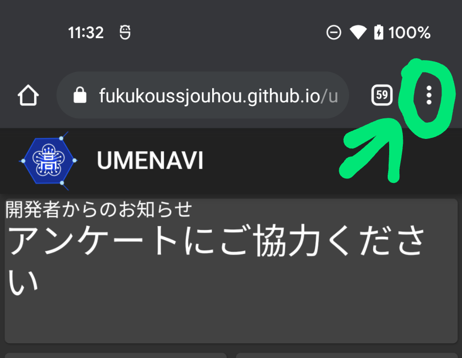
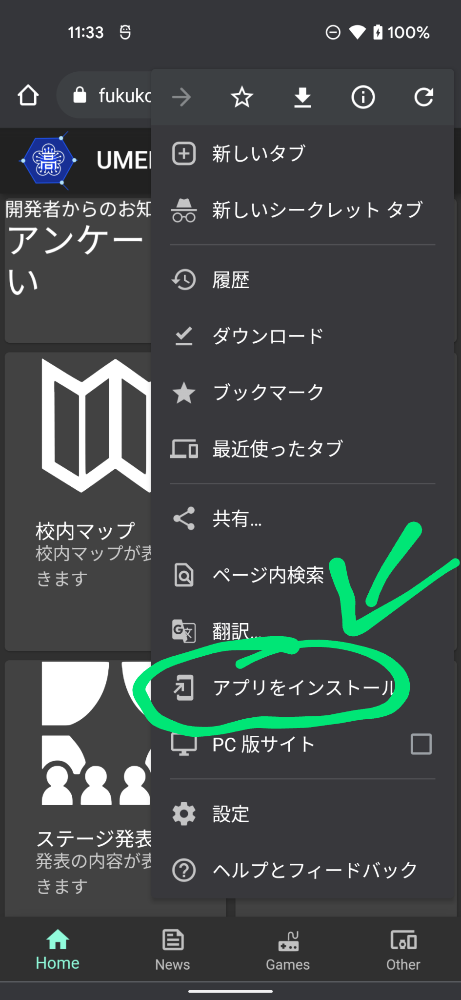
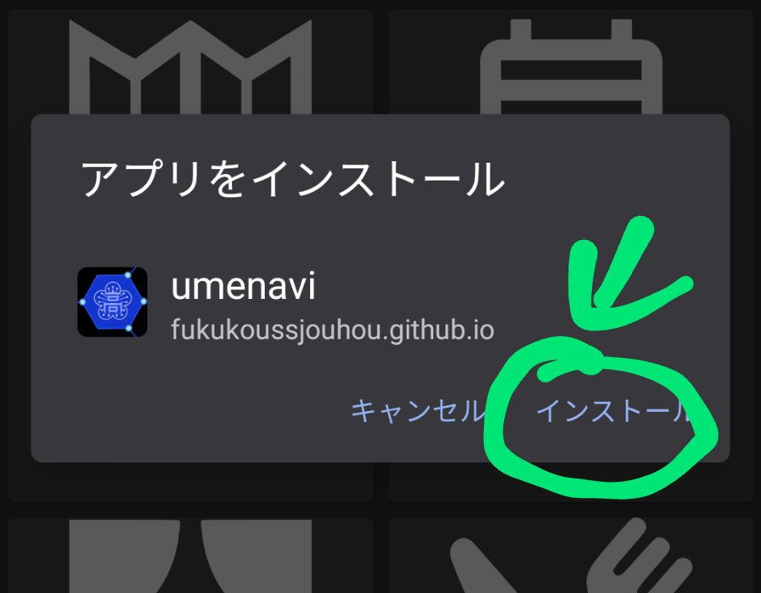

インストール
============

================
サイトへアクセス
================
こちらのサイトへアクセスしてください。

* |UMENAVI_W| 

.. |UMENAVI_W| raw:: html

    <a href="https://fukukoussjouhou.github.io/umenavi_web/" target="_blank">UMENAVI for Web </a>

================
インストール
================

各項目を見てください。

どっちかわからない人は

裏にリンゴマークがあれば
iOS/iPad OSです。

Android端末の場合
----------------------

ここをクリックしてメニューを開きます。

そしたらアプリをインストールをタップします。

なんか出てくるのでインストール押せば完了です。

ホーム画面から起動して楽しみましょう。

iOS/iPad OS端末の場合
-----------------------

実機がないので画像が取れません。

ホームに追加でも押してくださいな。

あとポップアップブロック無効化しないと投票不可能なのでそこらへん注意すること。

